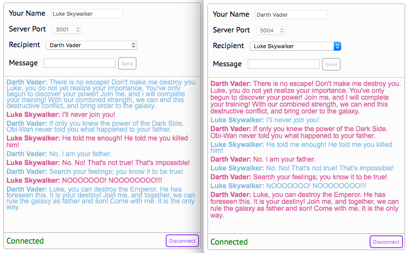

# react-chat-client

## What is this?
A React-based chat client for communicating with my 
[node-multi-server-chat](https://github.com/cliffhall/node-multi-server-chat) example.

This client differs from the minimalist one that comes with the server project in a few ways:

  * It lets you log in with any number of different users (instead of the predefined Anna and Billy)
  * It allows you to choose the recipient of each outgoing message from a dropdown of all connected users
  * It displays scrollable message history 
  * It notifies you when your selected recipient disconnects
  * If your lost recipient reconnects, it notifies you and selects them again in the dropdown
  * It stores and displays messages by thread, so you can carry on separate conversations with different users
  * When you receive a message from another user, it automatically selects them as a recipient and shows their thread
  
You can [read a tutorial](https://itnext.io/building-a-react-based-chat-client-with-redux-816b47cb8c74) 
about how it was built with only React and then refactored to use Redux.

## Two users chatting 


## Setup

### Install Node and npm
[Node](https://nodejs.org/en/download/) 7.7 or above (also installs npm)

### Install Node modules
```cd path/to/react-chat-client``` (the rest of this document assumes you are at this location)

```npm install```

### Initialize server project
For convenience, this project pulls in the [node-multi-server-chat](https://github.com/cliffhall/node-multi-server-chat)
project as a Git submodule. After you run the following command, you'll find that project in the ```server``` folder,
with its node-modules installed.

```npm run install-server-module```

## Launch

### Launching Socket Server Instances
Several npm scripts have been defined in ```package.json``` for launching the socket server instances.

#### Inside your IDE
If you're running a modern IDE like Webstorm, you can just open the npm window and double-click on each ```start-server-x``` script. 
A separate integrated terminal will launch and you can monitor each instance's log output.

#### From the command line
In each of four separate terminal windows, enter one of the following commands: 

```npm run start-server-1```

```npm run start-server-2```

```npm run start-server-3```

```npm run start-server-4```

### Launching the Server for the React Chat Client
The [react-scripts](https://www.npmjs.com/package/react-scripts) library will compile the client bundle and start the server for the client.

```npm run serve-client```

Once that's done, open a couple of browser windows, navigate to ```http://localhost:3000/```, enter two different user
names, choose a server port, and connect. It doesn't matter if you're on different ports or the same port, the servers
will make sure your messages make it to each other. 

Note that when you connect the first user, you won't see anything other than a status message of 'Connected' and the 
'Connect' button will change to 'Disconnect'. As soon as you sign in another user, you'll see a dropdown with
'Choose someone to message' in it. As users connect and disconnect, this list will be updated on all connected clients,
and of course your own name won't be listed.

## Implementation
This React client uses:
  * [redux](https://github.com/reduxjs/redux) to manage application state
  * [react-redux](https://github.com/reduxjs/react-redux) to inject the store's dispatch function and selected parts of the 
application state into any component's props. 

## Protocol handling
The protocol is outlined in the [chat server README](https://github.com/cliffhall/node-multi-server-chat/blob/master/README.md#protocol), 
so there's no need to duplicate that here. This client operates the same as the minimalist chat client in the server project, 
except all the protocol handling is encapsulated in the ```Socket``` class.

The ```socketMiddleware``` middleware instantiates a ```Socket``` instance, passing in callbacks for
  
  * ```onConnectionChange```, called when the socket connection state changes
  * ```onError```, called when the socket experiences an error condition, so status can be reported
  * ```onIncomingMessage```, called when an instant message is received
  * ```onUpdateClient```, called when the server updates the client with the list of connected users

## TODO

  * Pretty it up with [React-Bootstrap](https://react-bootstrap.github.io/components/alerts/).